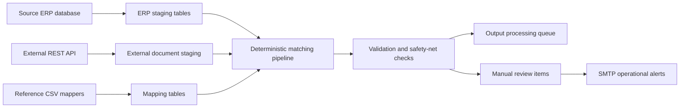

# Enterprise Match Engine Demo


An anonymized backend integration demo showing a production-style pipeline that synchronizes records from a source ERP database and an external REST API, normalizes data, builds multi-stage matches, validates edge cases, creates processing queues, and routes ambiguous cases to manual review.

## What this project demonstrates

- Oracle data ingestion through dedicated query functions.
- External REST API integration with OAuth client credentials, token caching, retry handling for rate limits, and token refresh after authorization failures.
- SQLAlchemy-based persistence layer with staging, matching, final match, output queue, and manual-review tables.
- Multi-step deterministic matching pipeline: header match, position match, best-match selection, final position match, queue generation, cleanup, and safety-net validations.
- Idempotent processing using `OPEN` / `RESOLVED` states and `last_seen_at` timestamps.
- Operational notifications through SMTP.
- Scheduled execution using APScheduler.
- Local demo mode that does not require Oracle or external API access.

## Architecture



## Main entry points

- `app.py` - runs the full pipeline once.
- `python app.py --demo` - initializes a local SQLite database with synthetic reference data and skips live integrations.
- `scheduler.py` - runs scheduled synchronization.
- `config.py` - reads environment configuration.
- `oracle_client.py` - source database access layer.
- `external_api_client.py` - external API client.
- `models.py` - SQLAlchemy data model.
- `jobs.py` - compatibility facade that re-exports public job functions.

## Local setup

```bash
python -m venv .venv
source .venv/bin/activate  # Windows: .venv\\Scripts\\activate
pip install -e ".[dev]"
cp .env.example .env
python app.py --demo
pytest
```

For live integrations, install optional database drivers and provide real environment variables locally only:

```bash
pip install -e ".[live]"
python app.py
```

## Refactored job structure

The original prototype kept the whole processing pipeline in a single large `jobs.py` file. The portfolio version keeps `jobs.py` as a small compatibility facade and splits implementation into focused modules:

- `status_sync_jobs.py` - ticket status synchronization.
- `source_sync_jobs.py` - source ERP synchronization and source-derived records.
- `external_sync_jobs.py` - external document synchronization and derived external aggregates.
- `mapper_sync_jobs.py` - reference mapper and product catalog synchronization.
- `matching_jobs.py` - header, position, best-match and final-match builders.
- `source_validation_jobs.py` - source/reference-data validation.
- `matching_validation_jobs.py` - matching validation and safety-net checks.
- `queue_jobs.py` - output queue creation and cleanup.
- `notification_jobs.py` - SMTP notification rendering and dispatch.
- `jobs_common.py` - shared constants and helper functions.

## Quality gates

```bash
python -m py_compile *.py
pytest
ruff check .
black --check .
```

The repository includes unit tests for normalization, matching helpers, manual-review fingerprinting, and rounding behavior.

## Anonymization notes

This repository contains no production credentials, customer data, production endpoint URLs, real organization names, or original CSV reference data. CSV files contain synthetic demo rows only.

The SQL queries and table names were anonymized to preserve the integration structure without exposing proprietary schema details.

## Final repository structure note

The production-sized job layer was split into smaller modules to make the code easier to review:

- `pipeline.py` contains the top-level orchestration.
- `jobs.py` remains a compatibility facade for imports used by the scheduler and CLI.
- Matching, validation, synchronization, queue building, queue cleanup, and notification logic are kept in separate modules.
- Demo mode can be run without Oracle or external API credentials:

```bash
python app.py --demo
pytest
```
